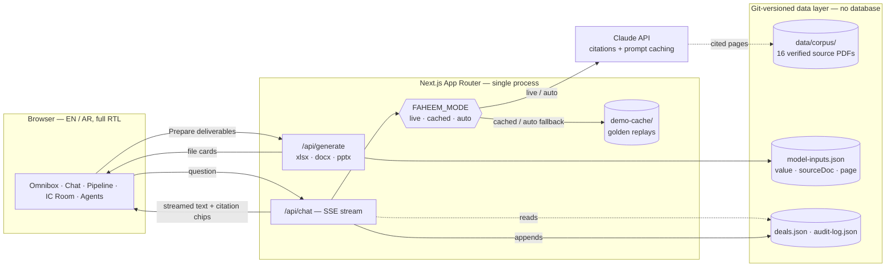

<p align="center">
  
</p>

<h1 align="center">Faheem</h1>

<p align="center">
  <b>Agentic AI for the Saudi investment desk</b> — screening → deep analysis → investment committee,<br/>
  with a human decision gate at every stage.
</p>

<p align="center">
  <a href="https://nextjs.org"></a>
  <a href="https://www.typescriptlang.org"></a>
  
  
  
</p>

Faheem puts an agentic research desk in front of an investment firm's own workflow: a deal enters the pipeline — inbound pitch or a market screen — passes a **Screening Agent** scorecard against the firm's mandate, goes through a seven-team **deep-analysis** engine (research, document intelligence, valuation & modeling, comparables, risk, deliverable writing, verification & compliance), and lands in front of an advisory-only **Investment Committee** agent that ranks deals against the fund's hurdle rate but never decides for it. Every number the app shows — in a chat answer, a scorecard, or a generated Excel model — resolves to a clickable citation into the underlying document, at the page, with the passage highlighted. The product is bilingual down to the CSS: English and Arabic, full logical-property RTL, built around **Jahez** (Tadawul: 6017) as the live case study, backed by a 16-document, page-verified corpus.

## Why Faheem is different

- **Every number is a live citation, not a claim.** Click a citation chip on a streamed answer and the source PDF opens at the exact cited page with the passage highlighted in the text layer. This is enforced by the Claude API's citation mechanism, not a prompt instruction — an answer cannot render a figure that isn't traceable to a real page.
- **A deal-pipeline workflow, not a chatbot.** A Screening Agent produces a mandate-fit scorecard that cites the firm's own Investment Committee Charter row by row, and a **Faheem IC** advisor ranks analysis-complete deals against the hurdle rate — always framed as a recommendation with rationale, never a decision.
- **Bilingual to the bone.** Every string routes through `next-intl`; Arabic isn't a translated skin — it's a full RTL layout built on logical CSS properties, and Arabic-language questions are answered by the same citation-enforced engine over the same source documents.
- **Deliverables that read like an analyst wrote them.** "Prepare the IC memo, DCF model, and committee deck" generates an Excel valuation workbook with real formula chains (WACC build, DCF, sensitivity tables, trading comps), a Word IC memo, and a PowerPoint board deck — every populated cell carries a source comment, all rendered in the client's own brand, not Faheem's.
- **Bring your own document.** Drop a PDF into a workspace and it joins the same citation-enforced retrieval engine that grounds every other answer — no separate ingestion pipeline to trust.
- **Governance is the product.** A full audit trail of every question, source, and generated artifact; three human decision gates across the pipeline (advance past screening, analyst sign-off on deliverables, committee decision); an impartial, evidence-first analyst register. Enterprise controls (SSO, formal certifications) are scoped to the MVP roadmap — asserted honestly, not claimed early.

## Screenshots

<p align="center">
  
  <br/><sub>Home — the omnibox hero, English</sub>
</p>

|                                                                                                                              |                                                                                                                |
| ---------------------------------------------------------------------------------------------------------------------------- | -------------------------------------------------------------------------------------------------------------- |
|                                            |                                                           |
| **Flagship chat** — streamed answer, inline citation chips, source PDF opened at the cited page with the passage highlighted | **Deal pipeline** — Screening → Analysis → IC Review → Decided, filterable by inbound vs. market-screen origin |
|                                                                               |                                                                     |
| **Faheem IC room** — two analysis-complete deals compared against the 15% IRR hurdle, advisory-only                          | **Agents** — Screening, the seven analysis teams, and Faheem IC, grouped by pipeline stage                     |
|                                                                     |                                        |
| **Home, Arabic** — full RTL flip, live language toggle                                                                       | **Generated deliverables** — Excel model, IC memo, and board deck, previewed inline                            |

## Quickstart

**Prerequisites:** Node 26+ and npm. Optional: LibreOffice (artifact open-tests), Ghostscript + Poppler (corpus tooling — `pdfinfo`, `gs`).

```bash
git clone git@github.com:sawtag/faheem-new.git
cd faheem-new
npm ci
cp .env.example .env
npm run dev
```

Open `http://localhost:3000` and sign in with **any username and password** — auth is intentionally mocked for the demo. `ANTHROPIC_API_KEY` is optional: **the app runs fully offline in cached mode, replaying recorded golden answers with realistic streaming — no key needed to see the full product.**

`FAHEEM_MODE` (env var, cookie `faheem_mode` overrides it at runtime) controls how chat answers are sourced:

- `cached` — replays a recorded, human-reviewed answer with simulated token streaming. Fully offline, deterministic, no API key.
- `live` — calls the real Claude API with the corpus as cited document blocks.
- `auto` — tries live, falls back to cached on a timeout (venue-wifi-safe).

Two hidden affordances make the cached demo path reliable: **⌘K** opens a palette of the recorded golden questions — selecting one inserts the exact text the cache was recorded against, so no on-stage typo can cause a miss. **⌘.** opens a small mode-switch overlay showing whether the last answer was served live or from cache.

| Command                              | What it does                                                             |
| ------------------------------------ | ------------------------------------------------------------------------ |
| `npm install`                        | Install dependencies (npm only, deliberately — no bun anywhere)          |
| `npm run dev`                        | Start the Next.js dev server                                             |
| `npm run check`                      | `tsc --noEmit` + ESLint + Prettier `--check`                             |
| `npm run test`                       | Vitest — unit + integration suite                                        |
| `npm run test:e2e`                   | Playwright — full suite across two viewports, `FAHEEM_MODE=cached`       |
| `FAHEEM_E2E_PROD=1 npm run test:e2e` | Same suite against a production build (`next build && next start`)       |
| `npm run validate:data`              | Zod-validates the corpus manifest, `deals.json`, and `model-inputs.json` |
| `npm run verify`                     | `check` + `test` + `validate:data` — the pre-commit gate                 |

## Architecture



```
faheem/
├─ app/              Next.js App Router — routes + API handlers
│  ├─ (app)/         authenticated shell: home, deals, ic, agents, library, skills…
│  ├─ api/           chat (SSE), generate, documents, upload, auth
│  └─ login/         mock-auth screen (any credentials)
├─ components/
│  ├─ chat/          composer, streaming answer, citation chips, PDF panel
│  ├─ deals/ ic/ generate/ shell/   per-screen surfaces
│  ├─ demo/          ⌘K golden palette, ⌘. mode overlay
│  └─ ui/            shared primitives (radix-ui wrapped)
├─ lib/
│  ├─ ai/            Claude client, corpus manifest, agent registry, prompts, cache
│  ├─ generate/      xlsx / docx / pptx builders, Lunar-branded
│  ├─ demo/          golden-question registry, deliverables detector
│  └─ types.ts       shared contracts (zod schemas)
├─ data/             git-versioned JSON — deals, model-inputs, audit-log, corpus/
│  └─ corpus/        16 page-verified source PDFs + manifest
├─ messages/         en.json / ar.json (next-intl)
├─ e2e/              Playwright specs — 170 tests × 2 viewports
├─ tests/            Vitest unit/integration — 297 tests
└─ scripts/          corpus fetch, cache prewarm, golden recording, data validation
```

**Chat pipeline:** a question hits `/api/chat`, which emits SSE "agent stage" events (which specialist agents are "reading" which documents) while the real model call runs — corpus PDFs are passed as Claude document blocks with `citations: {enabled: true}` and a 1-hour prompt cache on the corpus prefix, so citations carry real page numbers by construction, never a hallucinated reference. One chat engine serves three contexts (firm home, a company workspace, the IC room) by swapping system-prompt flavor and document subset — `@agent` mentions pin a specialist, `#doc` references scope the corpus.

## Data integrity

Every displayed figure in Faheem resolves to `data/model-inputs.json` or `data/deals.json`, and every entry carries `{ value, sourceDoc, page }` pointing into the 16-document, page-verified corpus in `data/corpus/` (Jahez's own annual report, earnings releases, and interim financials, plus the firm's authored Investment Committee Charter and deal-specific data-room packs). `npm run validate:data` runs a zod schema gate over the manifest, `deals.json`, and `model-inputs.json` on every `verify` run — malformed or unsourced data fails the build before it ships. **If a number has no source, it does not ship.**

## Testing

- **297 unit and integration tests** (Vitest + Testing Library) across 50 files — chat logic, citation resolution, artifact generation, data validation, zod contracts.
- **170 end-to-end tests** (Playwright), run at both a 1920×1080 desktop viewport and a 1366×768 laptop viewport — the full route inventory, the golden chat path, deliverable generation and download, and connections/onboarding flows.
- **Cached-mode determinism**: the e2e suite runs entirely against `FAHEEM_MODE=cached`, asserting zero off-host network requests (the pdfjs worker is vendored locally, not CDN-loaded) and byte-identical golden answers on every run.
- **A dedicated RTL sweep** walks the full route inventory in Arabic, asserting `dir="rtl"`, no leaked i18n keys, and no horizontal overflow from the layout flip.

## About

Built for the **Amad 2026** hackathon (Alinma Bank × Tuwaiq Academy), Track 1 — Generative AI for Fintech. Faheem is a product of **Lunar Technologies**. The demo client, **Lunar Investments**, is a fictional firm; Jahez financial data is drawn from Jahez Group's own public disclosures and used here as a verified, page-cited corpus.

All rights reserved.
