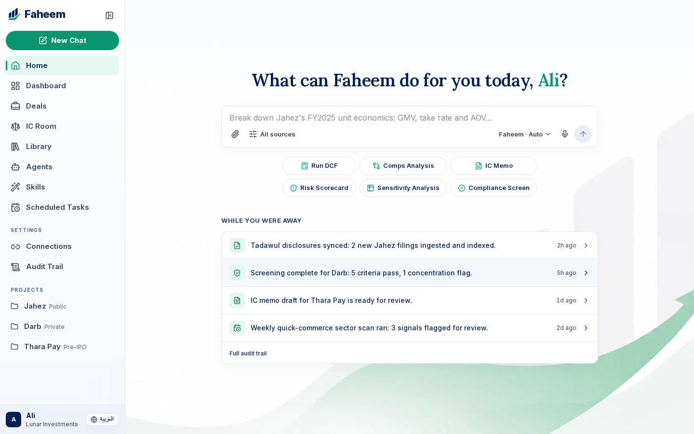
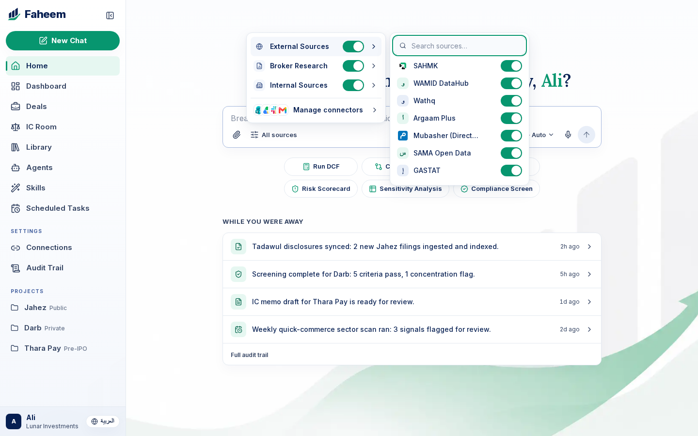
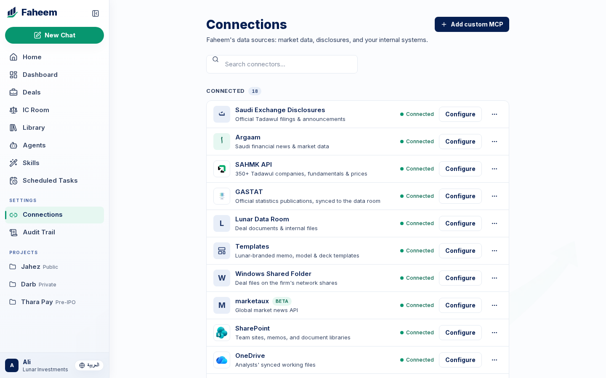
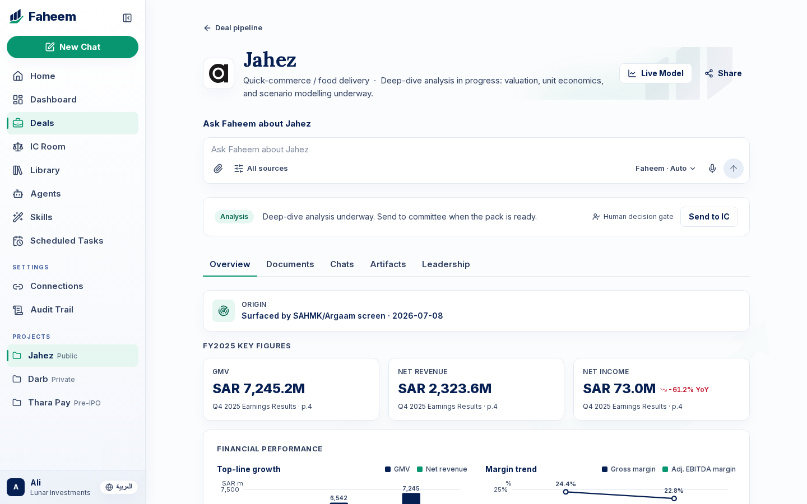
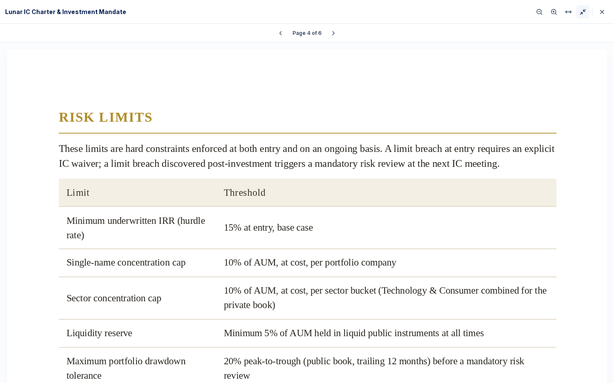
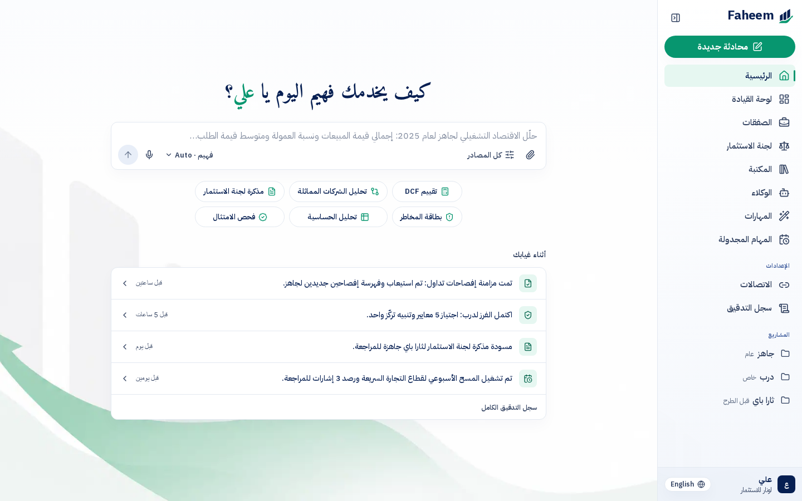
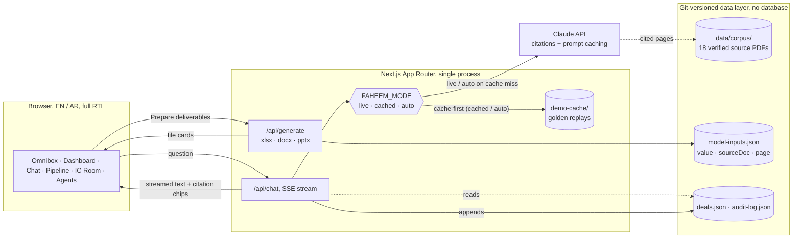

<p align="center">
  
</p>

<h1 align="center">Faheem</h1>

<p align="center">
  <b>Agentic AI for the Saudi investment desk</b>: screening → deep analysis → investment committee,<br/>
  with a human decision gate at every stage.
</p>

<p align="center">
  <a href="https://nextjs.org"></a>
  <a href="https://www.typescriptlang.org"></a>
  
  
  
</p>

<p align="center">
  <a href="https://drive.google.com/file/d/1hPPSXHAkfq7GJbIA5kGWd6WFIv0haoay/view?usp=sharing"><b>▶️ Watch the demo video</b></a>
</p>

Faheem runs an agentic research desk inside an investment firm's real workflow: a deal clears a **Screening Agent** mandate-fit check, works through a fourteen-agent **deep-analysis** engine, and lands in front of an advisory-only **Faheem IC** agent that weighs it against the firm's 15% Benchmark, and never decides for the firm.

🔗 Every number (in a chat answer, a scorecard, or a generated Excel model) resolves to a clickable citation into the source document, at the page, passage highlighted.

🌐 Bilingual down to the CSS: English and Arabic, full RTL, built around **Jahez** (Tadawul: 6017) as the live case study over an 18-document, page-verified corpus.

## ⚡ Why Faheem is different

- 🔗 **Every number is a live citation, not a claim.** Click a citation chip on a streamed answer and the source PDF opens at the exact cited page, passage highlighted in the text layer, enforced by the Claude API's citation mechanism, not a prompt instruction.
- 📈 **The valuation model is alive in your browser.** The Jahez DCF isn't a static export, `lib/model/` is the exact same pure TypeScript engine that builds the Excel, recomputing every dependent cell (WACC, DCF, sensitivity grids) the instant an assumption changes, with the numbers matching the workbook byte for byte.
- 🔍 **"No orphan numbers" is a tested guarantee, not a slogan.** Click any figure and a Methodology panel opens: plain-language explainer → the real rendered formula → each input as a drillable chip, the chain always bottoms out at a cited source page or a labeled assumption, and a walk-every-rendered-number check enforces it in CI, not just on the happy path.
- 🗣️ **Tell the model what to change, in plain language.** "Raise FY26 order growth to 20%" recomputes the DCF live while the specialist team works in the open, Valuation re-derives, Critical Review re-verifies the provenance chain, Compliance re-checks the compliance ratios, Writing updates the write-up. Sourced actuals stay immutable: try to edit one and Faheem explains why, gracefully, instead of pretending to comply.
- 🧭 **A deal-pipeline workflow, not a chatbot.** A Screening Agent scores mandate-fit against the firm's own IC Charter, row by row; **Faheem IC** weighs analysis-complete deals against the 15% Benchmark, always evidence and assessment, never the decision.
- 🚧 **Guardrailed like an analyst, not a chatbot.** Faheem handles finance and investment topics only: anything else gets a one-sentence decline and a redirect. And it never makes decisions or recommendations; ask it "should we invest?" and it lays out the cited evidence on each side, then hands the call back to the human analyst and the Committee.
- 🧮 **A dashboard built for governance.** Mandate headroom tracked live against the IC Charter's 10% concentration cap, firm AUM, and an Analysis Runs panel, every analysis is a logged, auditable run through the specialist teams selected for it, each citing exactly which documents it read.
- 🌐 **Bilingual to the bone.** Every string routes through `next-intl`; Arabic isn't a translated skin, it's a full RTL layout on logical CSS properties, answered by the same citation-enforced engine over the same corpus.
- 📊 **Deliverables that read like an analyst wrote them.** "Generate the investment memo" produces the Word memo in the firm's internal template; "Convert this memo into a slide deck" turns it into the branded committee deck; "Prepare the IC memo, DCF model, and committee deck" lands all three in one turn, every populated cell and figure sourced. One engine produces memo, model, and deck, so they can never disagree with each other.
- 🧾 **The workbook opens beside the chat, alive.** The generated Excel model isn't a thumbnail: a side panel renders the real sheets (Assumptions, DCF, Scenarios & Risk, Sensitivity, Comps) from the same client-safe engine that built the file, select any cell and a formula bar shows its rendered formula, its source page, or its labeled assumption.
- 📧 **Draft the IC email without leaving the workspace.** A compose modal pre-fills recipients and a Faheem-written body citing the live model's headline numbers, fully editable, then opens in Outlook for a human to send; the audit trail grows either way.
- 📥 **Bring your own document.** Drop a PDF into a workspace and it joins the same citation-enforced retrieval engine that grounds every other answer, no separate ingestion pipeline to trust.
- 📚 **Playbooks, not a blank prompt box.** A Skills library of analyst methodologies, DCF, comps, risk scorecards, Compliance screens, invoked like commands: type "/" in the composer and pick a skill, it fires the exact reviewed request. Any table in a streamed answer toggles inline into an animated chart. Scheduled Tasks previews the automation roadmap.
- 👥 **Fourteen specialist agents, including an adversarial red team.** Accounting & Quality-of-Earnings, Critical Review, News & Market Intelligence, and Market Sentiment join the original ten. Sentiment reads a clearly-labeled illustrative social pack and speaks in a label + one-line rationale, always flagged "signal only, not a valuation input", it never claims a sourced number.
- 🛡️ **Governance is the product.** A full audit trail of every question, source, and generated artifact; three human decision gates across the pipeline; an impartial, evidence-first analyst register. Enterprise controls (SSO, formal certifications) stay honestly scoped to the roadmap.

## 📸 Screenshots

<p align="center">
  
  <br/><sub>Home, the omnibox hero, the "while you were away" briefing panel, and the sidebar, English</sub>
</p>

|                                                                                                                |                                                                                                                    |
| -------------------------------------------------------------------------------------------------------------- | ------------------------------------------------------------------------------------------------------------------ |
|                                  |                                                            |
| **Data sources picker**, GCC-first sources (Tadawul disclosures, SAHMK, Argaam, Mubasher, SAMA, GASTAT, Wathq) | **Connections catalog**, every connected source behind an analysis, market data, disclosures, and internal systems |
|                                                   |                                              |
| **Deal workspace**, Jahez key figures and financial performance, deep-dive analysis in progress                | **Cited source**, the IC Charter PDF opened at the cited page, maximized                                           |

<p align="center">
  
  <br/><sub>Home, Arabic, full RTL flip</sub>
</p>

## 🎬 The demo

▶️ **[Watch the full demo video](https://drive.google.com/file/d/1hPPSXHAkfq7GJbIA5kGWd6WFIv0haoay/view?usp=sharing)**

Four scenes and two backup cards, driven end to end from the ⌘K palette and the "/" skill invoker so nothing gets mistyped on stage. Every beat replays a verified recording or a deterministic local build, so the entire demo runs air-gapped; in auto mode the same beats stay cached-first while novel judge questions go live. The printable stage script is `demo_flow.txt`; the bare prompts are in `prompts.txt`.

1. **Jahez, the lookup.** FY2025 unit economics, every figure a citation chip; click one and the PDF opens at the cited page with the passage highlighted. Follow-ups push back on management's own one-off framing. Then "Generate the investment memo" lands the Word memo, and "Convert this memo into a slide deck" turns it into the branded committee deck in the same thread.
2. **The `/dcf` skill.** Type "/", pick DCF FCFF Build: bull / base / bear against the 15% Benchmark, and the workbook opens beside the chat as a live grid, real formulas, a source comment on every cell. The Live Model recomputes on assumption edits; sourced actuals refuse to move.
3. **Darb, the private data room.** The IC memo from the firm's internal template, sources appendix included, then "Prepare the IC memo, DCF model, and committee deck" lands the full three-file package in one line, and the Library shows everything produced with its source counts.
4. **The IC room.** A GASTAT macro check before the Thara Pay vote, then a direct challenge to the Jahez WACC beta, which Faheem answers by defending what is sourced and flagging its own unfinished input. Closes on "Advisory only: the investment decision rests with the committee."

**Backup cards:** the Thara Pay investment case (click the risk score on its deal card for the full weighted, sourced derivation) and Aqar Development, the deal the firm declined last year, re-argued against fresh macro data without re-litigating the mandate.

## 📋 Feature status

Where the product stands: everything shipped at `demo-rc2` versus the next wave from `BUILD-BRIEF.md` (detailed in `docs/superpowers/plans/2026-07-13-live-model-provenance-plan.md`).

| Feature                                                                                                                                                               | Wave       | Status         |
| --------------------------------------------------------------------------------------------------------------------------------------------------------------------- | ---------- | -------------- |
| Login + onboarding (connector catalog, mandate questionnaire → IC Charter)                                                                                            | `demo-rc2` | ✅ Implemented |
| Deal pipeline + Darb screening scorecard (human gate #1)                                                                                                              | `demo-rc2` | ✅ Implemented |
| Jahez chat with citation chips + PDF passage highlighting                                                                                                             | `demo-rc2` | ✅ Implemented |
| Arabic / Compliance beat, bilingual EN/AR, full RTL                                                                                                                   | `demo-rc2` | ✅ Implemented |
| Deliverables generation (xlsx / docx / pptx) + in-app preview                                                                                                         | `demo-rc2` | ✅ Implemented |
| IC room deal assessment vs. the 15% Benchmark (advisory-only)                                                                                                         | `demo-rc2` | ✅ Implemented |
| Dashboard, mandate headroom + Analysis Runs panel                                                                                                                     | `demo-rc2` | ✅ Implemented |
| Audit trail                                                                                                                                                           | `demo-rc2` | ✅ Implemented |
| Skills library                                                                                                                                                        | `demo-rc2` | ✅ Implemented |
| Live PDF upload into the citation engine                                                                                                                              | `demo-rc2` | ✅ Implemented |
| Stage safety: ⌘K golden palette, ⌘. mode overlay, cached/auto/live modes, preflight script                                                                            | `demo-rc2` | ✅ Implemented |
| 10-agent roster (Screening, 7 analysis teams, IC, orchestrator)                                                                                                       | `demo-rc2` | ✅ Implemented |
| Extract `computeModel()` to pure `lib/model/` (snapshot-gated, byte-identical outputs)                                                                                | WS-A       | ✅ Implemented |
| Provenance engine, `Provenance` / `ValueNode` types, zero orphan numbers (tested)                                                                                     | WS-A       | ✅ Implemented |
| Methodology panel, explainer → formula (KaTeX) → inputs → drill to highlighted source PDF                                                                             | WS-A2      | ✅ Implemented |
| Grid spike + kill-switch decision (gate G1)                                                                                                                           | WS-B0      | ✅ Implemented |
| Live Model UI, the Jahez DCF as an interactive grid                                                                                                                   | WS-B       | ✅ Implemented |
| Conversational model edits, editable assumptions, source-locked actuals, agent choreography                                                                           | WS-C       | ✅ Implemented |
| Roster expansion to ~14 agents (Accounting/QoE, Critical Review, News Intelligence, Sentiment)                                                                        | WS-D       | ✅ Implemented |
| Sentiment card, qualitative signal over a labeled illustrative social pack                                                                                            | WS-D       | ✅ Implemented |
| Draft-to-IC email (compose modal → `mailto`, human sends)                                                                                                             | WS-E       | ✅ Implemented |
| Integration: ⌘K Live Model entries, golden-path e2e beat, preflight venue checks, run-of-show + docs updates (offline-deterministic edits, no new API goldens needed) | WS-F       | ✅ Implemented |
| Slash-invoked skills: "/" in the composer fires the recorded playbook run                                                                                             | stage      | ✅ Implemented |
| Live workbook side panel beside the chat (real sheets, formula bar, per-cell source)                                                                                  | stage      | ✅ Implemented |
| Paced cached replay: agent choreography + LLM-feel streaming, fully offline                                                                                           | stage      | ✅ Implemented |
| Analyst guardrails: finance-only scope; no decisions or recommendations, ever                                                                                         | stage      | ✅ Implemented |
| Memo-to-deck conversion + declined-deal re-evaluation (Aqar decline pack)                                                                                             | stage      | ✅ Implemented |

## 🏗️ Architecture



```
faheem/
├─ app/              Next.js App Router, routes + API handlers
│  ├─ (app)/         authenticated shell: home, dashboard, deals (+ Live Model), ic, agents, library, skills, scheduled tasks…
│  ├─ api/           chat (SSE), model-edit, generate, documents, upload, auth
│  └─ login/         mock-auth screen (any credentials)
├─ components/
│  ├─ chat/          composer, streaming answer, citation chips, PDF panel
│  ├─ model/         Live Model grid, Methodology panel, conversational edit composer
│  ├─ deals/ ic/ generate/ shell/   per-screen surfaces
│  ├─ demo/          ⌘K palette (golden questions + Live Model beat), ⌘. mode overlay
│  └─ ui/            shared primitives (radix-ui wrapped)
├─ lib/
│  ├─ ai/            Claude client, corpus manifest, agent registry, prompts, cache
│  ├─ generate/      xlsx / docx / pptx builders, Lunar-branded
│  ├─ model/         pure valuation engine (compute, provenance, formulas), shared by the xlsx builder and the Live Model UI
│  ├─ demo/          golden-question + Live Model beat registries, deliverables detector
│  └─ types.ts       shared contracts (zod schemas)
├─ data/             git-versioned JSON, deals, model-inputs, audit-log, corpus/
│  └─ corpus/        16 page-verified source PDFs + manifest
├─ messages/         en.json / ar.json (next-intl)
├─ e2e/              Playwright specs, 118 specs × 2 viewports (236 total)
├─ tests/            Vitest unit/integration, 590 tests
└─ scripts/          corpus fetch, cache prewarm, golden recording, data validation
```

**Chat pipeline:** a question hits `/api/chat`, which emits SSE "agent stage" events (which specialist agents are "reading" which documents) while the real model call runs, corpus PDFs are passed as Claude document blocks with `citations: {enabled: true}` and a 1-hour prompt cache on the corpus prefix, so citations carry real page numbers by construction, never a hallucinated reference. One chat engine serves three contexts (firm home, a company workspace, the IC room) by swapping system-prompt flavor and document subset, `@agent` mentions pin a specialist, `#doc` references scope the corpus.

## 🔒 Data integrity

Every displayed figure resolves to `data/model-inputs.json` or `data/deals.json`, and every entry carries `{ value, sourceDoc, page }` pointing into the 18-document, page-verified corpus in `data/corpus/` (Jahez's annual report, earnings releases, and interim financials, plus the firm's authored IC Charter and deal-specific data-room packs). `npm run validate:data` runs a zod schema gate over the manifest, `deals.json`, and `model-inputs.json` on every `verify` run, malformed or unsourced data fails the build before it ships. **If a number has no source, it does not ship.**

## ✅ Testing

- **590 unit and integration tests** (Vitest + Testing Library) across 80 files, chat logic, citation resolution, artifact generation, data validation, zod contracts, the `lib/model/` valuation engine (snapshot-gated), provenance-graph invariants, and the model-edit scripted parser.
- **236 end-to-end tests** (118 specs × 2 viewports, Playwright), run at both a 1920×1080 desktop viewport and a 1366×768 laptop viewport, the full route inventory, the golden chat path, deliverable generation and download, connections/onboarding flows, and the Live Model beat (conversational edit → recompute → Methodology drill to a cited source PDF).
- **Cached-mode determinism**: the e2e suite runs entirely against `FAHEEM_MODE=cached`, asserting zero off-host network requests (the pdfjs worker is vendored locally, not CDN-loaded) and byte-identical golden answers on every run.
- **A dedicated RTL sweep** walks the full route inventory in Arabic, asserting `dir="rtl"`, no leaked i18n keys, and no horizontal overflow from the layout flip.

## 🏆 About

Built for the **Amad 2026** hackathon (Alinma Bank × Tuwaiq Academy), Track 1, Generative AI for Fintech. Faheem is a product of **Lunar Technologies**. The demo client, **Lunar Investments**, is a fictional firm; Jahez financial data is drawn from Jahez Group's own public disclosures and used here as a verified, page-cited corpus.

All rights reserved.
