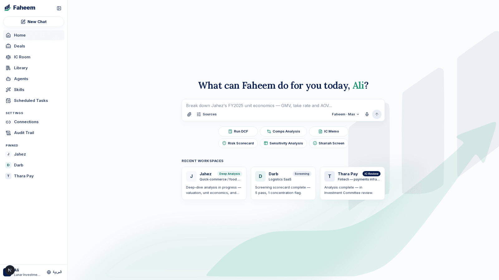
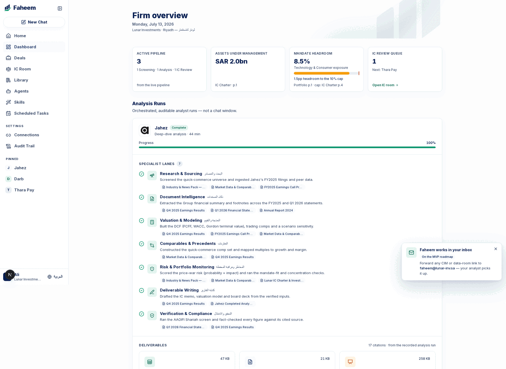
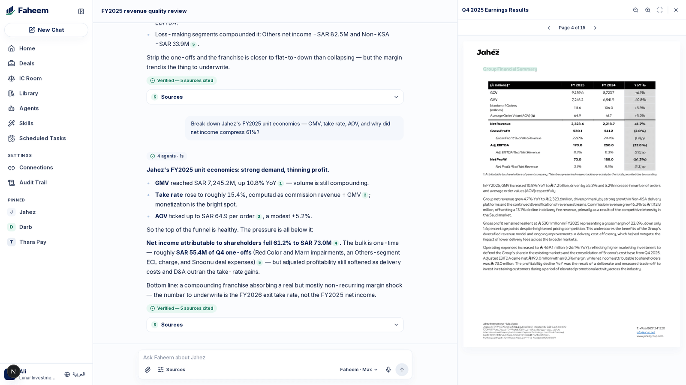
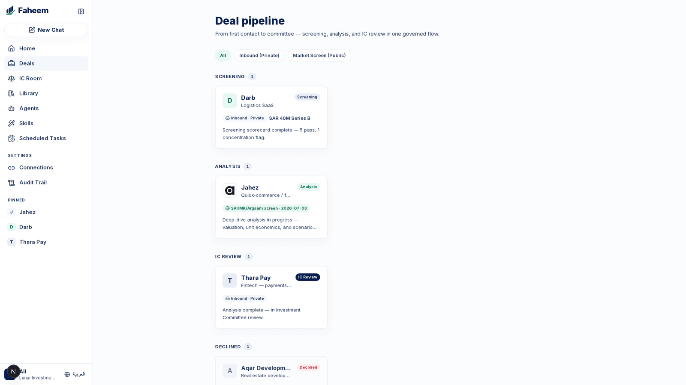
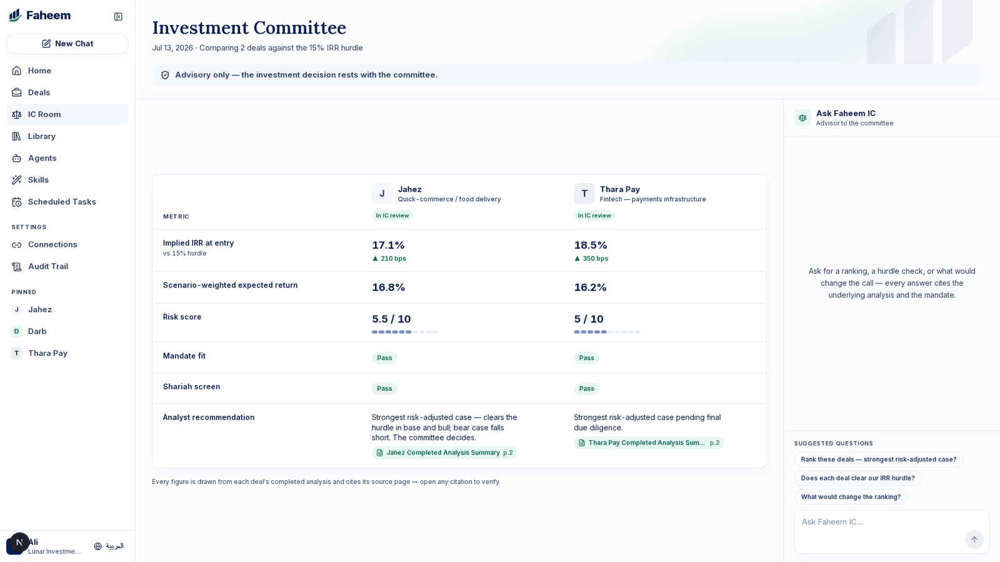
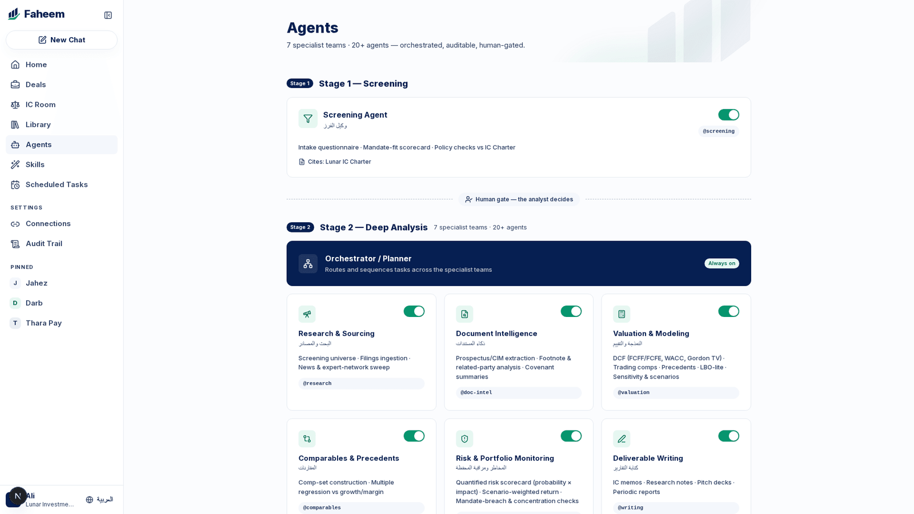
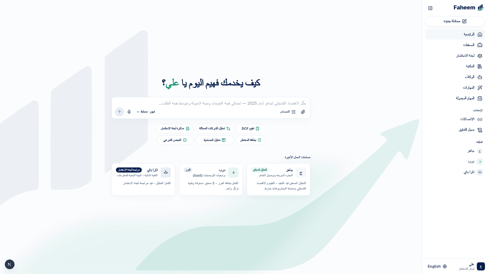
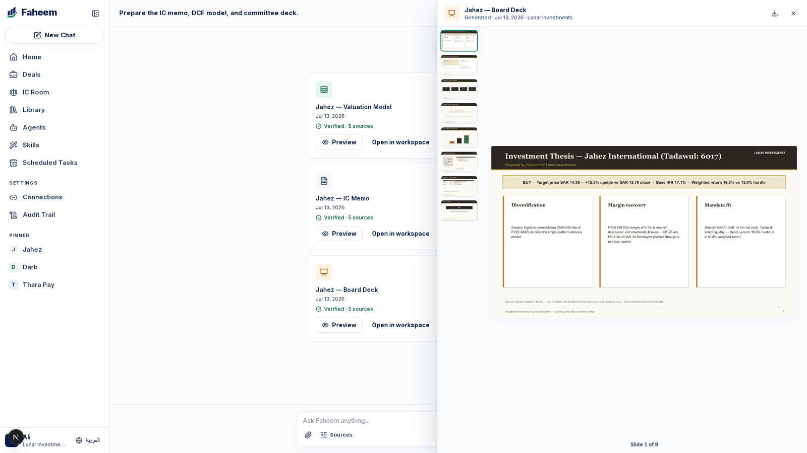

<p align="center">
  
</p>

https://github.com/user-attachments/assets/c040594d-95c6-43b1-922a-92dfd39fee00

<h1 align="center">Faheem</h1>

<p align="center">
  <b>Agentic AI for the Saudi investment desk</b> — screening → deep analysis → investment committee,<br/>
  with a human decision gate at every stage.
</p>

<p align="center">
  <a href="https://nextjs.org"></a>
  <a href="https://www.typescriptlang.org"></a>
  
  
  
</p>

Faheem runs an agentic research desk inside an investment firm's real workflow: a deal clears a **Screening Agent** mandate-fit check, works through a seven-team **deep-analysis** engine, and lands in front of an advisory-only **Faheem IC** agent that ranks it against the hurdle rate — and never decides for the firm.

🔗 Every number — in a chat answer, a scorecard, or a generated Excel model — resolves to a clickable citation into the source document, at the page, passage highlighted.

🌐 Bilingual down to the CSS: English and Arabic, full RTL, built around **Jahez** (Tadawul: 6017) as the live case study over a 16-document, page-verified corpus.

## ⚡ Why Faheem is different

- 🔗 **Every number is a live citation, not a claim.** Click a citation chip on a streamed answer and the source PDF opens at the exact cited page, passage highlighted in the text layer — enforced by the Claude API's citation mechanism, not a prompt instruction.
- 🧭 **A deal-pipeline workflow, not a chatbot.** A Screening Agent scores mandate-fit against the firm's own IC Charter, row by row; **Faheem IC** ranks analysis-complete deals against the hurdle rate — always a recommendation, never a decision.
- 🧮 **A dashboard built for governance.** Mandate headroom tracked live against the IC Charter's 10% concentration cap, firm AUM, and an Analysis Runs panel — every analysis is a logged, auditable run across 7 specialist lanes, each citing exactly which documents it read.
- 🌐 **Bilingual to the bone.** Every string routes through `next-intl`; Arabic isn't a translated skin, it's a full RTL layout on logical CSS properties — answered by the same citation-enforced engine over the same corpus.
- 📊 **Deliverables that read like an analyst wrote them.** "Prepare the IC memo, DCF model, and committee deck" generates a real Excel formula chain (WACC build, DCF, sensitivity tables, trading comps), a Word memo, and a PowerPoint deck — every populated cell sourced, all in the client's own brand.
- 📥 **Bring your own document.** Drop a PDF into a workspace and it joins the same citation-enforced retrieval engine that grounds every other answer — no separate ingestion pipeline to trust.
- 📚 **Playbooks, not a blank prompt box.** A Skills library of analyst methodologies — DCF, comps, risk scorecards, Shariah screens — one click either replays a golden run or prefills the composer. Any table in a streamed answer toggles inline into an animated chart. Scheduled Tasks previews the automation roadmap.
- 🛡️ **Governance is the product.** A full audit trail of every question, source, and generated artifact; three human decision gates across the pipeline; an impartial, evidence-first analyst register. Enterprise controls (SSO, formal certifications) stay honestly scoped to the roadmap.

## 📸 Screenshots

<p align="center">
  
  <br/><sub>Home — the omnibox hero, English</sub>
</p>

<p align="center">
  
  <br/><sub>Dashboard — mandate headroom, AUM, and the Analysis Runs panel: every analysis is a logged, auditable run</sub>
</p>

|                                                                                                                              |                                                                                                                |
| ---------------------------------------------------------------------------------------------------------------------------- | -------------------------------------------------------------------------------------------------------------- |
|                                            |                                                           |
| **Flagship chat** — streamed answer, inline citation chips, source PDF opened at the cited page with the passage highlighted | **Deal pipeline** — Screening → Analysis → IC Review → Decided, filterable by inbound vs. market-screen origin |
|                                                                               |                                                                     |
| **Faheem IC room** — two analysis-complete deals compared against the 15% IRR hurdle, advisory-only                          | **Agents** — Screening, the seven analysis teams, and Faheem IC, grouped by pipeline stage                     |
|                                                                     |                                        |
| **Home, Arabic** — full RTL flip, live language toggle                                                                       | **Generated deliverables** — Excel model, IC memo, and board deck, previewed inline                            |

## 🎬 The demo, beat by beat

The in-app walkthrough judges see, ⌘K-driven end to end so nothing gets mistyped on stage. Full run-of-show, including the slides either side of it, lives in `docs/superpowers/specs/2026-07-12-faheem-demo-design.md`.

| ⏱           | Beat                           | What you do                                                                 | What to ask                                                                                                                                                                                                                                   | What judges see                                                                                                                              |
| ----------- | ------------------------------ | --------------------------------------------------------------------------- | --------------------------------------------------------------------------------------------------------------------------------------------------------------------------------------------------------------------------------------------- | -------------------------------------------------------------------------------------------------------------------------------------------- |
| 0:00–0:30   | 🖥️ Dashboard open              | Land on `/dashboard`                                                        | —                                                                                                                                                                                                                                             | Active Pipeline, AUM, Mandate Headroom vs. the 10% concentration cap, and the Jahez Analysis Run — 7 specialist lanes, sources, deliverables |
| 0:30–2:00   | 🔌 Onboarding stepper          | Walk Connect & Configure                                                    | —                                                                                                                                                                                                                                             | Connector catalog, fake OAuth + "Add custom MCP", agent/skill toggles, mandate questionnaire → becomes the IC Charter                        |
| 2:00–3:30   | 📋 Pipeline + Darb scorecard   | Deals → Darb workspace → "Advance to pitch meeting"                         | —                                                                                                                                                                                                                                             | Mandate-fit scorecard citing the IC Charter row by row; **human gate #1**                                                                    |
| 3:30–6:30   | 💬 Jahez chat — unit economics | ⌘K → pick the question → send                                               | "Break down Jahez's FY2025 unit economics from #FY2025-Earnings-Release — GMV growth vs take rate, AOV, contribution margin, EBITDA margin — and why did net income compress ~61% despite double-digit GMV growth?" _(press ⌘K — never type)_ | Agent Activity timeline, streamed answer with citation chips → click one → the PDF opens at the cited page, passage highlighted              |
| 6:30–8:00   | ⚠️ @Risk follow-up             | ⌘K → pick the question → send                                               | "@Risk & Portfolio Monitoring — run a quantified risk assessment of the quick-commerce price war; does the position fit our mandate?" _(press ⌘K — never type)_                                                                               | Quantified risk scorecard citing both the industry pack and the Lunar IC Charter                                                             |
| 8:00–9:00   | 🕌 Arabic + Shariah            | Toggle language → ⌘K → pick the question → send                             | "هل يجتاز جاهز الفحص الشرعي وفق منهجية AAOIFI؟" _(press ⌘K — never type)_                                                                                                                                                                     | Full RTL flip, live; a Shariah screen card answered in Arabic with citations                                                                 |
| 9:00–10:30  | 📦 Deliverables                | ⌘K → pick the question → send → preview → open the Excel                    | "Prepare the IC memo, DCF model, and committee deck." _(press ⌘K — never type)_                                                                                                                                                               | Generation progress → in-app deck preview → Excel opens on DCF, Sensitivity, Comps — every cell source-commented                             |
| 10:30–11:30 | 📎 Upload any PDF              | Drop `demo-assets/talabat-q1-2026-results.pdf` into a workspace (live mode) | —                                                                                                                                                                                                                                             | ⌘. overlay confirms live mode; ~3s upload, cross-document answer in ~16s citing the new PDF                                                  |
| 11:30–12:30 | ⚖️ IC room ranking             | IC Room → ⌘K → pick the question → send                                     | "Rank these deals — strongest risk-adjusted case?" _(press ⌘K — never type)_                                                                                                                                                                  | Jahez vs. Thara Pay vs. the 15% hurdle; **"Advisory only — the committee decides"**; **human gate #3**                                       |
| 12:30–13:00 | 🧾 Audit trail close           | Open Audit Trail                                                            | —                                                                                                                                                                                                                                             | Every question, source, and artifact logged — the governance close                                                                           |

## 📋 Feature status

Where the product stands: everything shipped at `demo-rc2` versus the next wave from `BUILD-BRIEF.md` (detailed in `docs/superpowers/plans/2026-07-13-live-model-provenance-plan.md`).

| Feature                                                                                                        | Wave       | Status         |
| -------------------------------------------------------------------------------------------------------------- | ---------- | -------------- |
| Login + onboarding (connector catalog, mandate questionnaire → IC Charter)                                     | `demo-rc2` | ✅ Implemented |
| Deal pipeline + Darb screening scorecard (human gate #1)                                                       | `demo-rc2` | ✅ Implemented |
| Jahez chat with citation chips + PDF passage highlighting                                                      | `demo-rc2` | ✅ Implemented |
| Arabic / Shariah beat — bilingual EN/AR, full RTL                                                              | `demo-rc2` | ✅ Implemented |
| Deliverables generation (xlsx / docx / pptx) + in-app preview                                                  | `demo-rc2` | ✅ Implemented |
| IC room ranking vs. hurdle rate (advisory-only)                                                                | `demo-rc2` | ✅ Implemented |
| Dashboard — mandate headroom + Analysis Runs panel                                                             | `demo-rc2` | ✅ Implemented |
| Audit trail                                                                                                    | `demo-rc2` | ✅ Implemented |
| Skills library                                                                                                 | `demo-rc2` | ✅ Implemented |
| Live PDF upload into the citation engine                                                                       | `demo-rc2` | ✅ Implemented |
| Stage safety: ⌘K golden palette, ⌘. mode overlay, cached/auto/live modes, preflight script                     | `demo-rc2` | ✅ Implemented |
| 10-agent roster (Screening, 7 analysis teams, IC, orchestrator)                                                | `demo-rc2` | ✅ Implemented |
| Extract `computeModel()` to pure `lib/model/` (snapshot-gated, byte-identical outputs)                         | WS-A       | 🔲 Remaining   |
| Provenance engine — `Provenance` / `ValueNode` types, zero orphan numbers (tested)                             | WS-A       | 🔲 Remaining   |
| Methodology panel — explainer → formula (KaTeX) → inputs → drill to highlighted source PDF                     | WS-A2      | 🔲 Remaining   |
| Grid spike + kill-switch decision (gate G1)                                                                    | WS-B0      | 🔲 Remaining   |
| Live Model UI — the Jahez DCF as an interactive grid                                                           | WS-B       | 🔲 Remaining   |
| Conversational model edits — editable assumptions, source-locked actuals, agent choreography                   | WS-C       | 🔲 Remaining   |
| Roster expansion to ~14 agents (Accounting/QoE, Critical Review, News Intelligence, Sentiment)                 | WS-D       | 🔲 Remaining   |
| Sentiment card — qualitative signal over a labeled illustrative social pack                                    | WS-D       | 🔲 Remaining   |
| Draft-to-IC email (compose modal → `mailto`, human sends)                                                      | WS-E       | 🔲 Remaining   |
| Integration: new goldens, ⌘K entries, run-of-show beat, preflight + AGENTS.md + README updates, tag `demo-rc3` | WS-F       | 🔲 Remaining   |

## 🚀 Quickstart

**Prerequisites:** Node 26+ and npm. Optional: LibreOffice (artifact open-tests), Ghostscript + Poppler (corpus tooling — `pdfinfo`, `gs`).

```bash
git clone git@github.com:sawtag/faheem-new.git
cd faheem-new
npm ci
cp .env.example .env
npm run dev
```

Open `http://localhost:3000` and sign in with **any username and password** — auth is intentionally mocked for the demo. `ANTHROPIC_API_KEY` is optional: **the app runs fully offline in cached mode, replaying recorded golden answers with realistic streaming — no key needed to see the full product.**

**Three answer modes**, launched explicitly or chosen for you:

- `cached` — replays a recorded, human-reviewed answer with simulated token streaming. Fully offline, deterministic, no API key.
- `live` — calls the real Claude API with the corpus as cited document blocks.
- `auto` — tries live, falls back to cached on a timeout (venue-wifi-safe).

Pick one with a script — `npm run dev:cache | dev:auto | dev:live` (or `start:cache | start:auto | start:live` on a production build). Bare `npm run dev` / `npm start` uses a **smart default**: `auto` when a key is present, `cached` when it isn't — so a keyless clone always runs offline, and a keyed machine gets the live experience by default. The cookie set by the **⌘.** overlay overrides everything at runtime.

Two hidden affordances make the cached demo path reliable: **⌘K** opens a palette of the recorded golden questions — selecting one inserts the exact text the cache was recorded against, so no on-stage typo can cause a miss. **⌘.** opens a small mode-switch overlay showing whether the last answer was served live or from cache.

| Command                              | What it does                                                                      |
| ------------------------------------ | --------------------------------------------------------------------------------- |
| `npm install`                        | Install dependencies (npm only, deliberately — no bun anywhere)                   |
| `npm run dev`                        | Dev server (smart default mode); `dev:cache` / `dev:auto` / `dev:live` to pin one |
| `npm start`                          | Production server; `start:cache` / `start:auto` / `start:live` to pin one         |
| `npm run check`                      | `tsc --noEmit` + ESLint + Prettier `--check`                                      |
| `npm run test`                       | Vitest — unit + integration suite                                                 |
| `npm run test:e2e`                   | Playwright — full suite across two viewports, `FAHEEM_MODE=cached`                |
| `FAHEEM_E2E_PROD=1 npm run test:e2e` | Same suite against a production build (`next build && next start`)                |
| `npm run validate:data`              | Zod-validates the corpus manifest, `deals.json`, and `model-inputs.json`          |
| `npm run verify`                     | `check` + `test` + `validate:data` — the pre-commit gate                          |

## 🏗️ Architecture


```
faheem/
├─ app/              Next.js App Router — routes + API handlers
│  ├─ (app)/         authenticated shell: home, dashboard, deals, ic, agents, library, skills, scheduled tasks…
│  ├─ api/           chat (SSE), generate, documents, upload, auth
│  └─ login/         mock-auth screen (any credentials)
├─ components/
│  ├─ chat/          composer, streaming answer, citation chips, PDF panel
│  ├─ deals/ ic/ generate/ shell/   per-screen surfaces
│  ├─ demo/          ⌘K golden palette, ⌘. mode overlay
│  └─ ui/            shared primitives (radix-ui wrapped)
├─ lib/
│  ├─ ai/            Claude client, corpus manifest, agent registry, prompts, cache
│  ├─ generate/      xlsx / docx / pptx builders, Lunar-branded
│  ├─ demo/          golden-question registry, deliverables detector
│  └─ types.ts       shared contracts (zod schemas)
├─ data/             git-versioned JSON — deals, model-inputs, audit-log, corpus/
│  └─ corpus/        16 page-verified source PDFs + manifest
├─ messages/         en.json / ar.json (next-intl)
├─ e2e/              Playwright specs — 190 tests × 2 viewports
├─ tests/            Vitest unit/integration — 314 tests
└─ scripts/          corpus fetch, cache prewarm, golden recording, data validation
```

**Chat pipeline:** a question hits `/api/chat`, which emits SSE "agent stage" events (which specialist agents are "reading" which documents) while the real model call runs — corpus PDFs are passed as Claude document blocks with `citations: {enabled: true}` and a 1-hour prompt cache on the corpus prefix, so citations carry real page numbers by construction, never a hallucinated reference. One chat engine serves three contexts (firm home, a company workspace, the IC room) by swapping system-prompt flavor and document subset — `@agent` mentions pin a specialist, `#doc` references scope the corpus.

## 🔒 Data integrity

Every displayed figure resolves to `data/model-inputs.json` or `data/deals.json`, and every entry carries `{ value, sourceDoc, page }` pointing into the 16-document, page-verified corpus in `data/corpus/` (Jahez's annual report, earnings releases, and interim financials, plus the firm's authored IC Charter and deal-specific data-room packs). `npm run validate:data` runs a zod schema gate over the manifest, `deals.json`, and `model-inputs.json` on every `verify` run — malformed or unsourced data fails the build before it ships. **If a number has no source, it does not ship.**

## ✅ Testing

- **314 unit and integration tests** (Vitest + Testing Library) across 52 files — chat logic, citation resolution, artifact generation, data validation, zod contracts.
- **190 end-to-end tests** (Playwright), run at both a 1920×1080 desktop viewport and a 1366×768 laptop viewport — the full route inventory, the golden chat path, deliverable generation and download, and connections/onboarding flows.
- **Cached-mode determinism**: the e2e suite runs entirely against `FAHEEM_MODE=cached`, asserting zero off-host network requests (the pdfjs worker is vendored locally, not CDN-loaded) and byte-identical golden answers on every run.
- **A dedicated RTL sweep** walks the full route inventory in Arabic, asserting `dir="rtl"`, no leaked i18n keys, and no horizontal overflow from the layout flip.

## 🏆 About

Built for the **Amad 2026** hackathon (Alinma Bank × Tuwaiq Academy), Track 1 — Generative AI for Fintech. Faheem is a product of **Lunar Technologies**. The demo client, **Lunar Investments**, is a fictional firm; Jahez financial data is drawn from Jahez Group's own public disclosures and used here as a verified, page-cited corpus.

All rights reserved.
